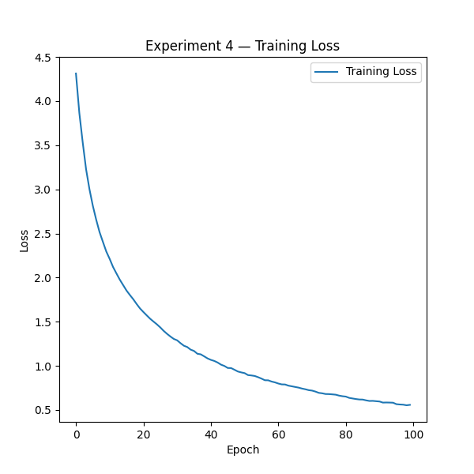
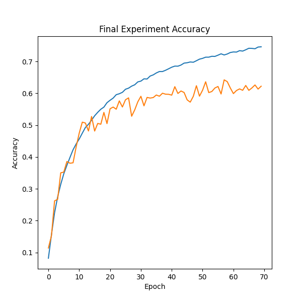
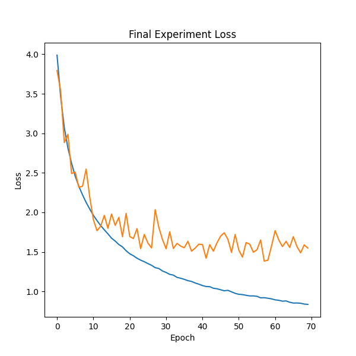

# 🧠 CIFAR-100 Image Classification
### Building Robust CNN Architectures with TensorFlow
---
Dependencies & Imports
This project utilizes TensorFlow/Keras to build, train, and evaluate a Convolutional Neural Network (CNN) on the CIFAR-100 dataset. The following core modules are imported:

* Data Handling: numpy for efficient array operations.
* Model Architecture: Sequential for layer stacking and various layers (Conv2D, MaxPooling2D, Dense, etc.) to define the CNN structure.
* Optimization & Loss: Adam optimizer and SparseCategoricalCrossentropy for effective multi-class classification.
* Visualization: matplotlib.pyplot for monitoring training metrics and performance analysis.
  
## Data Preparation

The project uses the **CIFAR-100** dataset, which consists of 60,000 32x32 color images across 100 distinct classes.
```python
(X_train, y_train), (X_test, y_test) = cifar100.load_data(label_mode='fine')
```
## Dataset Configuration
The project utilizes the CIFAR-100 dataset, containing 60,000 color images (32×32 resolution) categorized into 100 fine labels.

### Data Dimensions
The dataset is structured for CNN processing with the following tensor shapes:

- **Input Images**: `(N, 32, 32, 3)`  
  Representing `N` samples with height of 32, width of 32, and 3 color channels (RGB).
  - Training set size: 50,000
  - Testing set size: 10,000

- **Target Labels**: `(N, 1)`  
  Representing the single integer index for each class label.

*Note: The input pipeline expects these dimensions for optimal compatibility with the proposed CNN architecture.*

## Label Preprocessing
The CIFAR-100 target labels are originally loaded with shape `(N, 1)`.  
To simplify model training and evaluation, the labels are squeezed into a one-dimensional array with shape `(N,)` using `np.squeeze()`.

## Class Label Mapping and Image Visualization

CIFAR-100 provides numeric labels for its 100 image categories. The `fine_labels` list is used to map each label index to the corresponding class name, such as `apple`, `automobile`, `lion`, or `tiger`.

The following code displays a selected image from the training dataset and shows its class name as the plot title:
```python
i = int(input("Enter an image number: "))
plt.imshow(X_train[i])
plt.title(fine_labels[y_train[i]])
plt.savefig(f'{fine_labels[y_train[i]]}_image.png')
```
## Sample Dataset Images

Below is a sample of images from the CIFAR-100 training set with their corresponding fine-grained class labels:
<p align="center">
  
</p>
<p align="center">
  
</p>
<p align="center">
  
</p>
## Data Preprocessing & Normalization

Pixel intensities are originally represented as integers in the range `[0, 255]`. To optimize gradient descent and maintain numerical stability, the training and testing datasets are normalized to the `[0.0, 1.0]` range:
```python
X_train_norm = X_train.astype('float32') / 255.0
X_test_norm = X_test.astype('float32') / 255.0
```
## Experiments History

### Experiment 1: Baseline CNN
This initial model aims to set a performance baseline using a custom CNN architecture.

#### Architecture
- **Layers**: 2x Conv2D filters, MaxPooling, GlobalAveragePooling, and a stack of Dense layers with Dropout (0.3 - 0.5) to prevent overfitting.
- **Training**: Trained for 40 epochs with a batch size of 32.

#### Results
| Metric | Result |
| :--- | :--- |
| **Train Accuracy** | 5.64% |
| **Test Accuracy** | 5.39% |
| **Train Loss** | 579.22 |

> **Technical Note**: The high loss observed during evaluation is due to an input scale mismatch (evaluating on raw `[0, 255]` pixel data instead of normalized `[0, 1]` data). This has been identified and will be addressed in subsequent experiments.
#### Learning Curves (Experiment 1)
* Accuracy:
  
<p align="center">
  
</p>
* Loss:

<p align="center">
  
</p>

- **Observations**: 
  - The model experiences severe underfitting / plateauing early on due to the combination of `GlobalAveragePooling2D` directly after only two shallow conv layers and aggressive `Dropout` (up to 0.5) on small dense layers.
  - Tracking these curves serves as a visual benchmark for subsequent architectural iterations.

### Experiment 2: Deeper 4-Layer Convolutional Network

To enhance feature representation capacity for 100 fine-grained categories, the convolutional backbone was extended with a second convolutional block and trained for 60 epochs.

#### Architectural Modifications
- **Added Layer Block**: Added two consecutive `Conv2D(64, (3, 3), padding='same')` layers followed by a second `MaxPooling2D(2, 2)`.
- **Extended Training**: Epochs increased from 40 to 60.

| Metric / Split | Train Set | Test Set |
| :--- | :--- | :--- |
| **Accuracy** | **13.78%** | **12.37%** |
| **Loss** | **491.99** | **5.60e+02** |

#### Learning Curves
* Accuracy:
  
<p align="center">
  
</p>
* Loss:

<p align="center">
  
</p>

#### Key Takeaways
- Adding hierarchical depth allowed the network to learn higher-level spatial features compared to Experiment 1.
- *Note*: Ensure final evaluation is executed on normalized tensors (`X_test_norm`) to accurately reflect true test accuracy.

### 🧪 Experiment 3: Increasing Dense Capacity and Training Duration

#### 📌 Objective & Overview
Experiment 3 retains the convolutional feature extractor from Experiment 2 while increasing the capacity of the classification head. The model uses two dense layers with 256 and 128 units, moderate Dropout regularization, and a longer training schedule of 100 epochs.

The objective was to determine whether a larger fully connected classifier and additional training time could improve performance on the 100 fine-grained CIFAR-100 classes.

---

#### ⚙️ Architecture & Hyperparameters

| Component / Layer | Details |
| :--- | :--- |
| **Input Shape** | `(32, 32, 3)` normalized images |
| **Conv Block 1** | $2\times$ `Conv2D(128, 3×3, padding='same', relu)` → `MaxPooling2D(2×2)` |
| **Conv Block 2** | $2\times$ `Conv2D(128, 3×3, padding='same', relu)` → `MaxPooling2D(2×2)` |
| **Feature Aggregation** | `GlobalAveragePooling2D()` |
| **Classifier Head** | `Dense(256, relu)` → `Dropout(0.3)` → `Dense(128, relu)` → `Dropout(0.4)` |
| **Output Layer** | `Dense(100)` output logits |
| **Loss Function** | `SparseCategoricalCrossentropy(from_logits=True)` |
| **Optimizer** | `Adam(learning_rate=0.001)` |
| **Batch Size** | `32` |
| **Epochs** | `100` |
| **Validation Split** | `0.2` |

---

#### 🔑 Key Changes from Experiment 2

- **Higher Dense Capacity:** Used `Dense(256)` and `Dense(128)` to increase the model's classification capacity.
- **Longer Training:** Increased the training duration to **100 epochs**.
- **Moderate Regularization:** Applied `Dropout(0.3)` and `Dropout(0.4)` after dense layers.
- **Feature Extraction:** Maintained four convolutional layers with 128 filters to preserve the deeper feature-extraction backbone.

---

#### 📊 Visualizations & Learning Curves
* Accuracy:

<p align="center">
  
</p>

* Loss:
  
<p align="center">
  
</p>

---

#### 📈 Results & Evaluation Metrics

| Metric / Split | Train Set | Test Set |
| :--- | :---: | :---: |
| **Accuracy** | **22.10%** | **16.43%** |
| **Loss** | **1160.75** | **1.50e+03** |

---

#### 🔍 Analysis & Key Takeaways

- **Improved Accuracy:** Test accuracy increased from **12.37%** in the earlier experiments to **16.43%**, an improvement of approximately **4.06 percentage points**. This suggests that increasing dense-layer capacity and training longer helped the model learn more useful class-discriminative features.

- **Generalization Gap:** Training accuracy reached **22.10%**, while test accuracy was **16.43%**. The approximately **5.67 percentage-point gap** indicates the beginning of overfitting, although the model still has relatively low overall accuracy for CIFAR-100.

- **Unusually Large Evaluation Loss:** The train and test losses are very large compared with typical cross-entropy values. Since the loss function uses `from_logits=True`, verify that evaluation is performed with normalized images:
```python
  model_3.evaluate(X_train_norm, y_train)
  model_3.evaluate(X_test_norm, y_test)
``` 
## 🔬 Experiment 4: Batch Normalization & Deep Convolutional Blocks

### 🎯 Objective
Evaluate the impact of integrating **Batch Normalization** layers after deep convolutional feature extractors, combined with structured **Dropout** regularization, to stabilize training and improve generalizability on CIFAR-100.

---
## Experiments 4

### 🔬 Impact of Batch Normalization

Integrating **Batch Normalization** layers after each convolution block proved to be the most impactful architectural enhancement in this project so far, pushing the test accuracy to **61.09%**.

* **Internal Covariate Shift Reduction:** Standardizing layer inputs across mini-batches stabilized feature representations, allowing deep layers to train effectively without gradient vanishing or explosion issues.
* **Faster and Stable Convergence:** BatchNorm smoothed the loss landscape, enabling the model to fully utilize its high capacity and achieve **97.21%** training accuracy within 100 epochs.
* **Implicit Regularization:** Computing batch-level statistics introduced slight noise into activations, helping the deep network regularize better than using standalone Dropout.

#### ⚠️ The Remaining Bottleneck: Overfitting Gap
Although Batch Normalization dramatically improved optimization and representation capacity, it is not designed to eliminate data-scarcity overfitting on its own. With only 500 images per class in CIFAR-100, the network memorized training patterns (resulting in a **~36% generalization gap**). 

** Next Iteration Requirement:** Introducing **Data Augmentation** (Random Flip, Rotation, Shift) to expose the model to continuous data variations and bridge this generalization gap.

### 🏗️ Model Architecture
```python
model_4 = Sequential([
# Block 1
Conv2D(128, (3, 3), padding='same', activation='relu', input_shape=(32, 32, 3)),
Conv2D(128, (3, 3), padding='same', activation='relu'),
BatchNormalization(),
MaxPooling2D(2, 2),
Dropout(0.2),

# Block 2
Conv2D(128, (3, 3), padding='same', activation='relu'),
Conv2D(128, (3, 3), padding='same', activation='relu'),
BatchNormalization(),
MaxPooling2D(2, 2),
Dropout(0.3),

# Block 3
Conv2D(256, (3, 3), padding='same', activation='relu'),
Conv2D(256, (3, 3), padding='same', activation='relu'),
BatchNormalization(),
MaxPooling2D(2, 2),
Dropout(0.4),

# Classification Head
GlobalAveragePooling2D(),
Dense(256, activation='relu'),
Dropout(0.25),
Dense(128, activation='relu'),
Dropout(0.3),
Dense(100)
])
```
---

### 📈 Training Curves & Visualization

* Accuracy:

<p align="center">
  
</p>

* Loss:
  
<p align="center">
  
</p>

#### 📉 Curve Analysis:
* **Accuracy Trajectory:** The training curve demonstrates exceptionally smooth and steady growth throughout the 100 epochs, reaching **97.21%**, directly proving the training stabilization enabled by **Batch Normalization**.
* **Loss Minimization:** Training loss descends sharply and reaches a steady minimum plateau at **0.11**, indicating strong model convergence without optimization stalls or gradient explosion.

⚙️ Training Parameters
* Optimizer: Adam (
𝛼
=
0.0001
α=0.0001
)
* Loss: SparseCategoricalCrossentropy (from_logits=True)
* Batch Size: 32
* Epochs: 100

| Metric | Training Set | Test Set | Generalization Gap |
| :--- | :---: | :---: | :---: |
| **Accuracy** | **97.21%** | **61.09%** | **36.12%** |
| **Loss** | **0.11** | **1.70** | **1.59** |

## Phase 2: Data Augmentation for CIFAR-100

In the previous phase, four baseline CNN architectures were implemented and compared. In this phase, the best-performing model is retrained using data augmentation techniques.

The goal is to increase the effective diversity of the training data, reduce overfitting, and improve the model's generalization performance on validation and test data.

### Additional Imports

The following Keras utilities were added in this phase:
```python
from tensorflow.keras.preprocessing.image import ImageDataGenerator
from tensorflow.keras.layers import Activation
```
* `ImageDataGenerator` is used to apply real-time data augmentation to the training images, including transformations such as horizontal flipping, rotation, shifting, and zooming.
* `Activation` is used as a separate Keras layer to apply activation functions explicitly within the CNN architecture when needed.

### Data Preprocessing

The data loading, label reshaping, and pixel normalization steps remain unchanged from Phase 1.

For details, see the preprocessing section in the
[baseline experiment](notebooks/Cifar100_images_classification_CNN.ipynb).

## Importing `train_test_split`

To create separate training and validation subsets, the `train_test_split` function is imported from the `sklearn.model_selection` module:
```python
from sklearn.model_selection import train_test_split
```
## Splitting the Training Data into Training and Validation Sets

To evaluate the model during training without using the test set, the normalized training data is divided into two subsets:

- **Training set:** Used to learn the model parameters.
- **Validation set:** Used to monitor the model's performance on unseen samples during training.

In this split, 80% of the original training data is used for training and 20% is reserved for validation.
```python
X_train_split, X_val, y_train_split, y_val = train_test_split(
X_train_norm,
y_train,
test_size=0.2,
random_state=42,
stratify= y_train
)

X_val = X_val.astype('float32')
```
### Data Augmentation Strategy

We implemented a comprehensive augmentation pipeline using Keras `ImageDataGenerator`. 
The following parameters were configured to introduce spatial and geometric variations:

- **Spatial Transformations:** 
    - Rotation: 15° range
    - Zoom: 20% range
    - Shear: 30% intensity
    - Width/Height Shifts: 20% and 30% respectively
- **Flipping:** Enabled for both horizontal and vertical axes to handle orientation variance.
- **Fill Mode:** Set to `'constant'` to handle newly created pixels during transformations.

This pipeline generates batch-wise augmented data with a size of 32, ensuring the model sees a unique version of the dataset in every epoch.
## Training Data Pipeline

After splitting the normalized training data into training and validation subsets, the data augmentation pipeline is applied only to the training split.

The augmented training batches are generated from:

- `X_train_split`
- `y_train_split`

using `ImageDataGenerator.flow()`:
```python
train_generation = train_datagen.flow(
X_train_split,
y_train_split,
batch_size=32,
shuffle=True
)
```
<div align="center">

# CIFAR-100 CNN

A compact convolutional neural network for image classification on the CIFAR-100 dataset.

[](https://www.python.org/)
[](https://www.tensorflow.org/)
[](#license)

</div>

## Overview

This project trains a CNN to classify the 100 fine-grained classes in CIFAR-100. The model uses progressively wider convolution blocks, batch normalization, dropout, and global average pooling to keep the classifier compact while preserving spatial features.

## Architecture

The network follows a simple three-stage feature extractor. Each stage doubles the channel capacity, reduces the spatial resolution with max pooling, and applies dropout for regularization. Global average pooling replaces a large flattening layer before the final classifier.

| Stage | Layers | Output shape | Dropout |
|---|---|---:|---:|
| Input | RGB image | `32 x 32 x 3` | — |
| Block 1 | `Conv2D(64)` x2, BatchNorm + ReLU, MaxPool | `16 x 16 x 64` | `0.10` |
| Block 2 | `Conv2D(128)` x2, BatchNorm + ReLU, MaxPool | `8 x 8 x 128` | `0.15` |
| Block 3 | `Conv2D(256)` x2, BatchNorm + ReLU, MaxPool | `4 x 4 x 256` | `0.20` |
| Classifier | GlobalAveragePooling, Dense(256, ReLU) | `256` | `0.30` |
| Output | Dense(100) logits | `100` | — |

### Model definition

```python
inputs = keras.Input(shape=(32, 32, 3))
x = inputs

for filters, dropout in [(64, 0.10), (128, 0.15), (256, 0.20)]:
    x = layers.Conv2D(filters, 3, padding="same")(x)
    x = layers.BatchNormalization()(x)
    x = layers.Activation("relu")(x)
    x = layers.Conv2D(filters, 3, padding="same")(x)
    x = layers.BatchNormalization()(x)
    x = layers.Activation("relu")(x)
    x = layers.MaxPooling2D()(x)
    x = layers.Dropout(dropout)(x)

x = layers.GlobalAveragePooling2D()(x)
x = layers.Dense(256, activation="relu")(x)
x = layers.Dropout(0.30)(x)
outputs = layers.Dense(100)(x)  # logits

model = keras.Model(inputs, outputs)
```

## Dataset & preprocessing

- **Dataset:** CIFAR-100, with `32 x 32` RGB images and `100` classes.
- Pixel values are converted to floating point and scaled to `[0, 1]`.
- The model returns logits for the 100 classes.
- Training augmentation uses random horizontal flips and small image translations.

```python
(x_train, y_train), (x_test, y_test) = keras.datasets.cifar100.load_data(
    label_mode="fine"
)
x_train = x_train.astype("float32") / 255.0
x_test = x_test.astype("float32") / 255.0
```

## Training

```python
loss = keras.losses.SparseCategoricalCrossentropy(from_logits=True)
model.compile(optimizer="adam", loss=loss, metrics=["accuracy"])

history = model.fit(
    x_train,
    y_train,
    validation_split=0.1,
    epochs=50,
    batch_size=64,
)
```

## Results

| Metric | Training | Test |
|---|---:|---:|
| Accuracy | **78.64%** | **62.35%** |
| Loss | **0.72** | **1.53** |

The gap between training and test accuracy indicates some overfitting. Stronger augmentation, weight decay, a learning-rate schedule, and additional validation-driven regularization could improve generalization.

## Learning curves

<div align="center">




</div>

## Inference

```python
import numpy as np
from tensorflow import keras

model = keras.models.load_model("path/to/model")
image = x_test[0:1]                         # shape: (1, 32, 32, 3)
logits = model.predict(image, verbose=0)
predicted_class = int(np.argmax(logits, axis=1)[0])
print(f"Predicted class index: {predicted_class}")
```

## Installation & usage

```bash
git clone https://github.com/python-is-life2022/Cifar100-images-classification-CNN.git
cd Cifar100-images-classification-CNN
pip install tensorflow numpy matplotlib
python train.py
```

Update the script name or model path to match your local entry point.

## Project structure

```text
.
├── charts/
│   ├── train_5_accuracy.png
│   └── train_5_loss.png
├── train.py
├── requirements.txt
└── README.md
```

## Future improvements

- Add a learning-rate scheduler and weight decay.
- Compare stronger augmentation policies.
- Track per-class accuracy and confusion matrices.
- Evaluate a lightweight pretrained backbone.

## Author

**Your Name**  
(https://www.linkedin.com/in/amir-kharazi-7b4a06259/)

## License

Released under the [MIT License](LICENSE).

## Phase 2: Final Augmented CNN

Experiment 5 uses the final augmented three-block CNN configuration. The network accepts `32 x 32 x 3` RGB images and increases feature capacity from 64 to 256 channels while progressively reducing spatial resolution.

### Data augmentation

```python
train_datagen = ImageDataGenerator(
    rotation_range=10,
    zoom_range=0.1,
    shear_range=0.1,
    horizontal_flip=True,
    vertical_flip=False,
    fill_mode="nearest",
    width_shift_range=0.1,
    height_shift_range=0.1,
)

train_generation = train_datagen.flow(
    X_train_split,
    y_train_split,
    batch_size=32,
    shuffle=True,
)
```

### Architecture

| Stage | Layers | Output shape | Dropout |
|---|---|---:|---:|
| Input | RGB image | `32 x 32 x 3` | — |
| Block 1 | `Conv2D(64)` x2, BatchNorm + ReLU, MaxPool2D | `16 x 16 x 64` | `0.10` |
| Block 2 | `Conv2D(128)` x2, BatchNorm + ReLU, MaxPool2D | `8 x 8 x 128` | `0.15` |
| Block 3 | `Conv2D(256)` x2, BatchNorm + ReLU, MaxPool2D | `4 x 4 x 256` | `0.20` |
| Classifier head | GlobalAveragePooling2D, Dense(256, ReLU) | `256` | `0.30` |
| Output | Dense(100) logits | `100` | — |

Each convolution uses a `3 x 3` kernel, `same` padding, and no bias because batch normalization follows it. The three blocks extract increasingly rich features, max pooling reduces the spatial dimensions, and dropout limits overfitting. Global average pooling keeps the classifier compact before the 256-unit dense layer and final 100-class logits.

### Model definition

```python
inputs = keras.Input(shape=(32, 32, 3))
x = inputs

x = layers.Conv2D(64, (3, 3), padding="same", use_bias=False)(x)
x = layers.BatchNormalization()(x)
x = layers.Activation("relu")(x)
x = layers.Conv2D(64, (3, 3), padding="same", use_bias=False)(x)
x = layers.BatchNormalization()(x)
x = layers.Activation("relu")(x)
x = layers.MaxPool2D((2, 2))(x)
x = layers.Dropout(0.1)(x)

x = layers.Conv2D(128, (3, 3), padding="same", use_bias=False)(x)
x = layers.BatchNormalization()(x)
x = layers.Activation("relu")(x)
x = layers.Conv2D(128, (3, 3), padding="same", use_bias=False)(x)
x = layers.BatchNormalization()(x)
x = layers.Activation("relu")(x)
x = layers.MaxPool2D((2, 2))(x)
x = layers.Dropout(0.15)(x)

x = layers.Conv2D(256, (3, 3), padding="same", use_bias=False)(x)
x = layers.BatchNormalization()(x)
x = layers.Activation("relu")(x)
x = layers.Conv2D(256, (3, 3), padding="same", use_bias=False)(x)
x = layers.BatchNormalization()(x)
x = layers.Activation("relu")(x)
x = layers.MaxPool2D((2, 2))(x)
x = layers.Dropout(0.2)(x)

x = layers.GlobalAveragePooling2D()(x)
x = layers.Dense(256, activation="relu")(x)
x = layers.Dropout(0.3)(x)
outputs = layers.Dense(100)(x)

model = keras.Model(inputs, outputs)
```

### Training configuration

```python
optimizer = keras.optimizers.Adam(learning_rate=0.001)
loss = keras.losses.SparseCategoricalCrossentropy(from_logits=True)

model.compile(
    optimizer=optimizer,
    loss=loss,
    metrics=["accuracy"],
)

history = model.fit(
    train_generation,
    epochs=70,
    verbose=2,
)
```

## Experiment 5 results

| Metric | Training | Test |
|---|---:|---:|
| Accuracy | **78.64%** | **62.35%** |
| Loss | **0.72** | **1.53** |

The training-to-test accuracy gap is **16.29 percentage points** (`78.64% - 62.35%`). Compared with the previous **36% gap**, this is a reduction of **19.71 percentage points**, or approximately **54.75%** relative improvement in the gap. The augmented model therefore generalizes substantially better, although the remaining gap indicates that some overfitting persists.

## Experiment 5 learning curves

<!-- Add the generated training accuracy chart at charts/train_5_accuracy.png. -->


<!-- Add the generated training loss chart at charts/train_5_loss.png. -->


