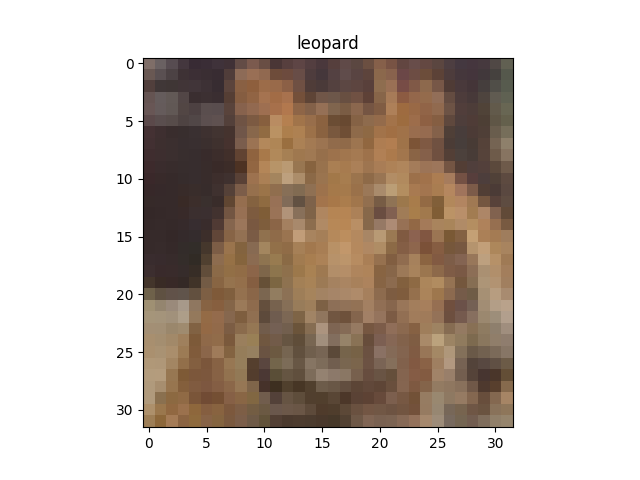
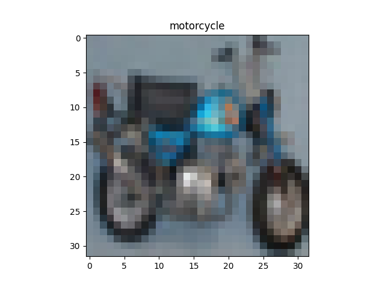
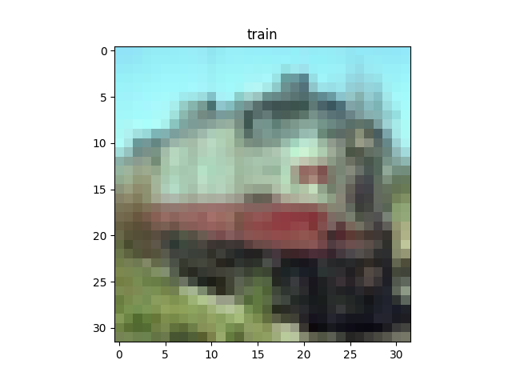
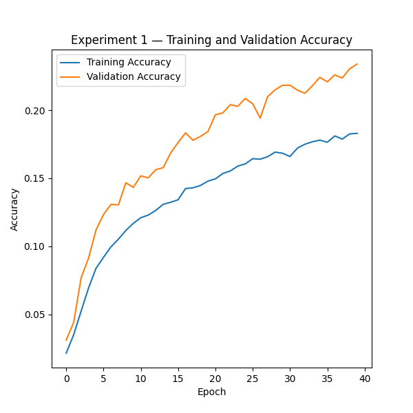
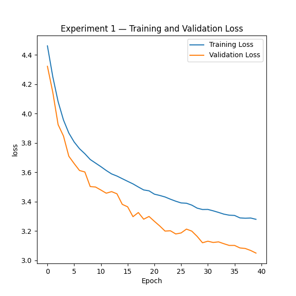
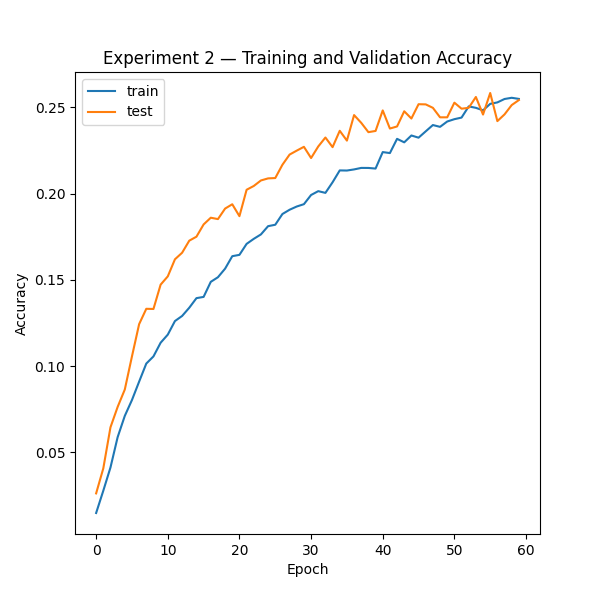
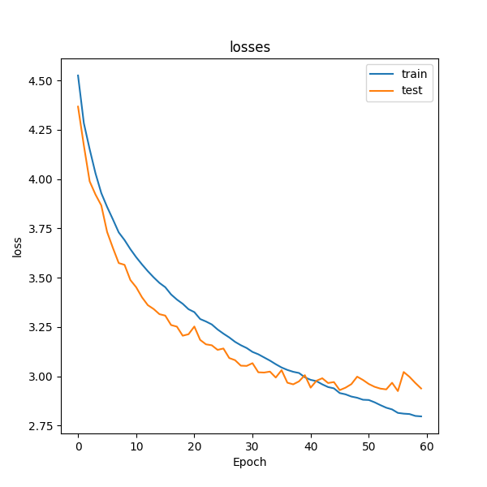
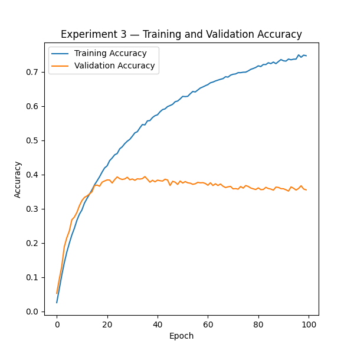
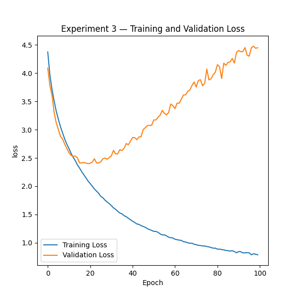
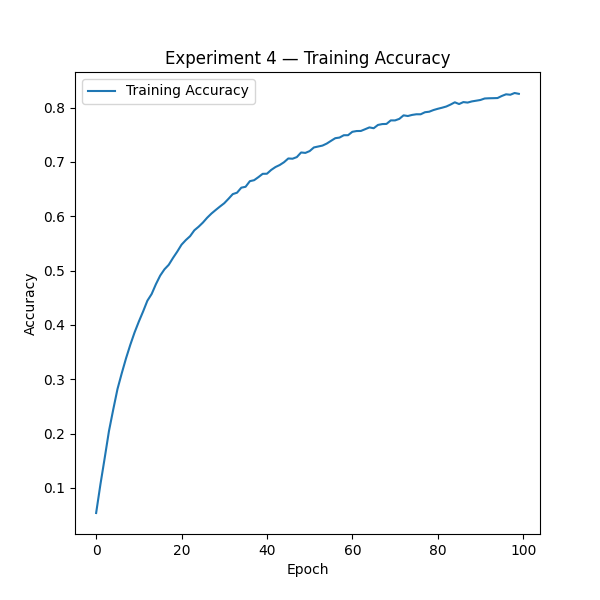

# 🧠 CIFAR-100 Image Classification
### Building Robust CNN Architectures with TensorFlow
---
Dependencies & Imports
This project utilizes TensorFlow/Keras to build, train, and evaluate a Convolutional Neural Network (CNN) on the CIFAR-100 dataset. The following core modules are imported:

* Data Handling: numpy for efficient array operations.
* Model Architecture: Sequential for layer stacking and various layers (Conv2D, MaxPooling2D, Dense, etc.) to define the CNN structure.
* Optimization & Loss: Adam optimizer and SparseCategoricalCrossentropy for effective multi-class classification.
* Visualization: matplotlib.pyplot for monitoring training metrics and performance analysis.
  
## Data Preparation

The project uses the **CIFAR-100** dataset, which consists of 60,000 32x32 color images across 100 distinct classes.
```python
(X_train, y_train), (X_test, y_test) = cifar100.load_data(label_mode='fine')
```
## Dataset Configuration
The project utilizes the CIFAR-100 dataset, containing 60,000 color images (32×32 resolution) categorized into 100 fine labels.

### Data Dimensions
The dataset is structured for CNN processing with the following tensor shapes:

- **Input Images**: `(N, 32, 32, 3)`  
  Representing `N` samples with height of 32, width of 32, and 3 color channels (RGB).
  - Training set size: 50,000
  - Testing set size: 10,000

- **Target Labels**: `(N, 1)`  
  Representing the single integer index for each class label.

*Note: The input pipeline expects these dimensions for optimal compatibility with the proposed CNN architecture.*

## Label Preprocessing
The CIFAR-100 target labels are originally loaded with shape `(N, 1)`.  
To simplify model training and evaluation, the labels are squeezed into a one-dimensional array with shape `(N,)` using `np.squeeze()`.

## Class Label Mapping and Image Visualization

CIFAR-100 provides numeric labels for its 100 image categories. The `fine_labels` list is used to map each label index to the corresponding class name, such as `apple`, `automobile`, `lion`, or `tiger`.

The following code displays a selected image from the training dataset and shows its class name as the plot title:
```python
i = int(input("Enter an image number: "))
plt.imshow(X_train[i])
plt.title(fine_labels[y_train[i]])
plt.savefig(f'{fine_labels[y_train[i]]}_image.png')
```
## Sample Dataset Images

Below is a sample of images from the CIFAR-100 training set with their corresponding fine-grained class labels:
<p align="center">
  
</p>
<p align="center">
  
</p>
<p align="center">
  
</p>
## Data Preprocessing & Normalization

Pixel intensities are originally represented as integers in the range `[0, 255]`. To optimize gradient descent and maintain numerical stability, the training and testing datasets are normalized to the `[0.0, 1.0]` range:
```python
X_train_norm = X_train.astype('float32') / 255.0
X_test_norm = X_test.astype('float32') / 255.0
```
## Experiments History

### Experiment 1: Baseline CNN
This initial model aims to set a performance baseline using a custom CNN architecture.

#### Architecture
- **Layers**: 2x Conv2D filters, MaxPooling, GlobalAveragePooling, and a stack of Dense layers with Dropout (0.3 - 0.5) to prevent overfitting.
- **Training**: Trained for 40 epochs with a batch size of 32.

#### Results
| Metric | Result |
| :--- | :--- |
| **Train Accuracy** | 5.64% |
| **Test Accuracy** | 5.39% |
| **Train Loss** | 579.22 |

> **Technical Note**: The high loss observed during evaluation is due to an input scale mismatch (evaluating on raw `[0, 255]` pixel data instead of normalized `[0, 1]` data). This has been identified and will be addressed in subsequent experiments.
#### Learning Curves (Experiment 1)
* Accuracy:
  
<p align="center">
  
</p>
* Loss:

<p align="center">
  
</p>

- **Observations**: 
  - The model experiences severe underfitting / plateauing early on due to the combination of `GlobalAveragePooling2D` directly after only two shallow conv layers and aggressive `Dropout` (up to 0.5) on small dense layers.
  - Tracking these curves serves as a visual benchmark for subsequent architectural iterations.

### Experiment 2: Deeper 4-Layer Convolutional Network

To enhance feature representation capacity for 100 fine-grained categories, the convolutional backbone was extended with a second convolutional block and trained for 60 epochs.

#### Architectural Modifications
- **Added Layer Block**: Added two consecutive `Conv2D(64, (3, 3), padding='same')` layers followed by a second `MaxPooling2D(2, 2)`.
- **Extended Training**: Epochs increased from 40 to 60.

| Metric / Split | Train Set | Test Set |
| :--- | :--- | :--- |
| **Accuracy** | **13.78%** | **12.37%** |
| **Loss** | **491.99** | **5.60e+02** |

#### Learning Curves
* Accuracy:
  
<p align="center">
  
</p>
* Loss:

<p align="center">
  
</p>

#### Key Takeaways
- Adding hierarchical depth allowed the network to learn higher-level spatial features compared to Experiment 1.
- *Note*: Ensure final evaluation is executed on normalized tensors (`X_test_norm`) to accurately reflect true test accuracy.

### 🧪 Experiment 3: Increasing Dense Capacity and Training Duration

#### 📌 Objective & Overview
Experiment 3 retains the convolutional feature extractor from Experiment 2 while increasing the capacity of the classification head. The model uses two dense layers with 256 and 128 units, moderate Dropout regularization, and a longer training schedule of 100 epochs.

The objective was to determine whether a larger fully connected classifier and additional training time could improve performance on the 100 fine-grained CIFAR-100 classes.

---

#### ⚙️ Architecture & Hyperparameters

| Component / Layer | Details |
| :--- | :--- |
| **Input Shape** | `(32, 32, 3)` normalized images |
| **Conv Block 1** | $2\times$ `Conv2D(128, 3×3, padding='same', relu)` → `MaxPooling2D(2×2)` |
| **Conv Block 2** | $2\times$ `Conv2D(128, 3×3, padding='same', relu)` → `MaxPooling2D(2×2)` |
| **Feature Aggregation** | `GlobalAveragePooling2D()` |
| **Classifier Head** | `Dense(256, relu)` → `Dropout(0.3)` → `Dense(128, relu)` → `Dropout(0.4)` |
| **Output Layer** | `Dense(100)` output logits |
| **Loss Function** | `SparseCategoricalCrossentropy(from_logits=True)` |
| **Optimizer** | `Adam(learning_rate=0.001)` |
| **Batch Size** | `32` |
| **Epochs** | `100` |
| **Validation Split** | `0.2` |

---

#### 🔑 Key Changes from Experiment 2

- **Higher Dense Capacity:** Used `Dense(256)` and `Dense(128)` to increase the model's classification capacity.
- **Longer Training:** Increased the training duration to **100 epochs**.
- **Moderate Regularization:** Applied `Dropout(0.3)` and `Dropout(0.4)` after dense layers.
- **Feature Extraction:** Maintained four convolutional layers with 128 filters to preserve the deeper feature-extraction backbone.

---

#### 📊 Visualizations & Learning Curves
* Accuracy:

<p align="center">
  
</p>

* Loss:
  
<p align="center">
  
</p>

---

#### 📈 Results & Evaluation Metrics

| Metric / Split | Train Set | Test Set |
| :--- | :---: | :---: |
| **Accuracy** | **22.10%** | **16.43%** |
| **Loss** | **1160.75** | **1.50e+03** |

---

#### 🔍 Analysis & Key Takeaways

- **Improved Accuracy:** Test accuracy increased from **12.37%** in the earlier experiments to **16.43%**, an improvement of approximately **4.06 percentage points**. This suggests that increasing dense-layer capacity and training longer helped the model learn more useful class-discriminative features.

- **Generalization Gap:** Training accuracy reached **22.10%**, while test accuracy was **16.43%**. The approximately **5.67 percentage-point gap** indicates the beginning of overfitting, although the model still has relatively low overall accuracy for CIFAR-100.

- **Unusually Large Evaluation Loss:** The train and test losses are very large compared with typical cross-entropy values. Since the loss function uses `from_logits=True`, verify that evaluation is performed with normalized images:
```python
  model_3.evaluate(X_train_norm, y_train)
  model_3.evaluate(X_test_norm, y_test)
``` 
## 🔬 Experiment 4: Batch Normalization & Deep Convolutional Blocks

### 🎯 Objective
Evaluate the impact of integrating **Batch Normalization** layers after deep convolutional feature extractors, combined with structured **Dropout** regularization, to stabilize training and improve generalizability on CIFAR-100.

---
## Experiments 4

### 🔬 Impact of Batch Normalization

Integrating **Batch Normalization** layers after each convolution block proved to be the most impactful architectural enhancement in this project so far, pushing the test accuracy to **61.09%**.

* **Internal Covariate Shift Reduction:** Standardizing layer inputs across mini-batches stabilized feature representations, allowing deep layers to train effectively without gradient vanishing or explosion issues.
* **Faster and Stable Convergence:** BatchNorm smoothed the loss landscape, enabling the model to fully utilize its high capacity and achieve **97.21%** training accuracy within 100 epochs.
* **Implicit Regularization:** Computing batch-level statistics introduced slight noise into activations, helping the deep network regularize better than using standalone Dropout.

#### ⚠️ The Remaining Bottleneck: Overfitting Gap
Although Batch Normalization dramatically improved optimization and representation capacity, it is not designed to eliminate data-scarcity overfitting on its own. With only 500 images per class in CIFAR-100, the network memorized training patterns (resulting in a **~36% generalization gap**). 

** Next Iteration Requirement:** Introducing **Data Augmentation** (Random Flip, Rotation, Shift) to expose the model to continuous data variations and bridge this generalization gap.

### 🏗️ Model Architecture
```python
model_4 = Sequential([
# Block 1
Conv2D(128, (3, 3), padding='same', activation='relu', input_shape=(32, 32, 3)),
Conv2D(128, (3, 3), padding='same', activation='relu'),
BatchNormalization(),
MaxPooling2D(2, 2),
Dropout(0.2),

# Block 2
Conv2D(128, (3, 3), padding='same', activation='relu'),
Conv2D(128, (3, 3), padding='same', activation='relu'),
BatchNormalization(),
MaxPooling2D(2, 2),
Dropout(0.3),

# Block 3
Conv2D(256, (3, 3), padding='same', activation='relu'),
Conv2D(256, (3, 3), padding='same', activation='relu'),
BatchNormalization(),
MaxPooling2D(2, 2),
Dropout(0.4),

# Classification Head
GlobalAveragePooling2D(),
Dense(256, activation='relu'),
Dropout(0.25),
Dense(128, activation='relu'),
Dropout(0.3),
Dense(100)
])
```
---

### 📈 Training Curves & Visualization




#### 📉 Curve Analysis:
* **Accuracy Trajectory:** The training curve demonstrates exceptionally smooth and steady growth throughout the 100 epochs, reaching **97.21%**, directly proving the training stabilization enabled by **Batch Normalization**.
* **Loss Minimization:** Training loss descends sharply and reaches a steady minimum plateau at **0.11**, indicating strong model convergence without optimization stalls or gradient explosion.

⚙️ Training Parameters
* Optimizer: Adam (
𝛼
=
0.0001
α=0.0001
)
* Loss: SparseCategoricalCrossentropy (from_logits=True)
* Batch Size: 32
* Epochs: 100

| Metric | Training Set | Test Set | Generalization Gap |
| :--- | :---: | :---: | :---: |
| **Accuracy** | **97.21%** | **61.09%** | **36.12%** |
| **Loss** | **0.11** | **1.70** | **1.59** |

